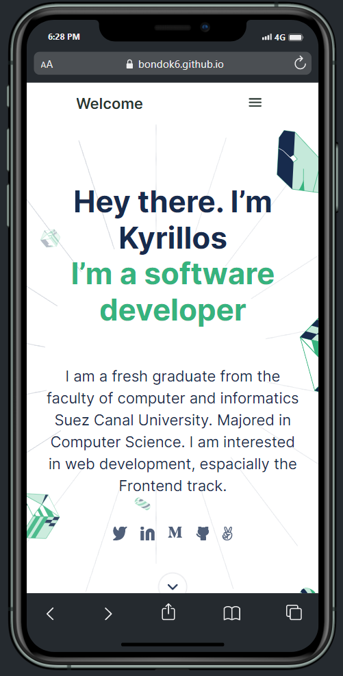
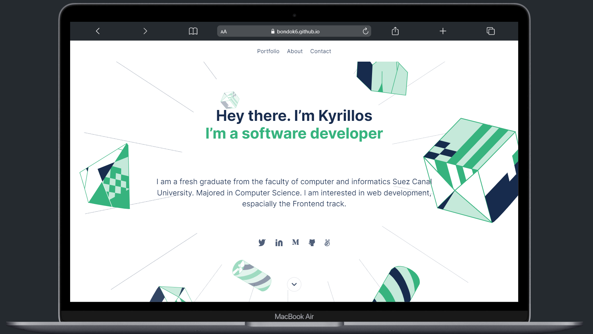

# Portfolio

> ### Portfolio website using pure **Bootstarp5**

## Built With

- HTML - HTML5
- Bootstrap5

## Additional tools

- Figma
- FormSpree

## Live Demo

[Live Demo Link](https://bondok6.github.io/Porfolio-bootstrap/index.html)

## Getting Started

To get a local copy up and running follow these simple example steps.

`git clone git@github.com:Bondok6/Portfolio-bootstrap.git`

## Authors

👤 **Author1**

- GitHub: [@Bondok6](https://github.com/Bondok6)
- LinkedIn: [LinkedIn](https://linkedin.com/in/linkedinhandle)

👤 **Author2**

- GitHub: [@fernando](https://github.com/fherrerao)
- LinkedIn: [LinkedIn](https://www.linkedin.com/in/fernando-herrera-25a6361b2/)

## 🤝 Contributing

Contributions, issues, and feature requests are welcome!

Feel free to check the [issues page](../../issues/).

## Show your support

Give a ⭐️ if you like this project!

## 📝 License

This project is [MIT](./MIT.md) licensed.
